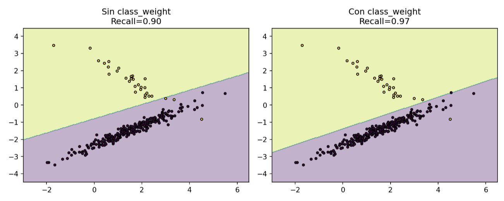

## Agenda {.agenda}

::: columns
::: {.column width="99%"}
| Bloque | Tema |
|---|---|
| `0:00–0:20` | ¿Qué es un experimento en ML? |
| `0:20–0:50` | De problema a pregunta científica |
| `0:50–1:10` | Hipótesis |
| `1:10–1:35` | Variables y principios de robustez |
| `1:35–1:50` | Métricas y baselines |
| `1:50–2:00` | Arquitectura y estructura del proyecto |
| Cierre | Ejercicio integrador |
:::

:::


# Bloque 1 {.title-section}

## ¿Qué es un experimento en ML?
*"ML es un aproximador universal de funciones @bishop2006pattern"*
```{mermaid}
graph LR
    subgraph "El Mundo Real"
        D[(Datos Crudos <br/> X, y)]
    end

    subgraph "El Proceso Experimental (Caja Negra)"
        direction TB
        H[Espacio de Hipótesis] --> P{Algoritmo de <br/> Aprendizaje}
        V[Variables de <br/> Control] --> P
    end

    subgraph "El Aproximador Universal"
        F{{"f(X) ≈ y"}} 
    end

    D --> P
    P --> F

    style F fill:#f9f,stroke:#333,stroke-width:4px
    style D fill:#e1f5fe,stroke:#01579b
    style P fill:#fff9c4,stroke:#fbc02d
```

---

## ¿Qué es un experimento en ML?

Al derraparnos en una bicicleta, un experimento no es "salir a ver qué pasa", es una prueba controlada para entender la relación entre el equipo y el terreno. En ML, hacemos lo mismo con datos y algoritmos.


---

## ML no es solo entrenar modelos

::: columns
::: {.column width="55%"}
La primera trampa: confundir el **medio** (pedalear) con el **fin** (ganar estabilidad).

> **Analogía:** Subirse a la bici es "entrenar". Medir cómo la presión de las llantas afecta tu frenado es un **experimento**.

:::
::: {.column width="45%"}
::: {.callout-important}
## Definición formal

$$\text{Experimento} = \text{H} + \text{D} + \text{M} + \text{P}$$

| Elemento | Significado |
|---|---|
| **H** | Hipótesis (¿30 PSI es mejor?) |
| **D** | Datos (La grava de la curva) |
| **M** | Métrica (Metros de derrape) |
| **P** | Protocolo (10 vueltas a 20km/h) |

Cada componente: definido **antes** de escribir código.
:::
:::
:::

---

## El costo del trial-and-error

::: columns
::: {.column width="55%"}
@sculley2015hidden — *hidden technical debt*:

Sin hipótesis previa, cada iteración es un "raspón" en los datos que no te enseña nada:

- Decisiones implícitas (¿Por qué bajé la presión?)
- Resultados no reproducibles (Ayer no me caí, hoy sí)
- Conclusiones vacías (Siento que "va mejor")
:::
::: {.column width="45%"}
::: {.callout-warning}
## El criterio de Popper

@popper1959logic — **Falsabilidad**:

Si no puedes definir de antemano qué resultado te haría decir "me equivoqué de presión", no estás haciendo ciencia.

**Pregunta obligatoria:**
*"¿Qué haría si con 30 PSI derrapo más que con 50?"*
:::
:::
:::

---

## El ciclo científico en ML

```{mermaid}
flowchart LR
    %% Estilos de colores simples
    classDef inicio fill:#e1f5fe,stroke:#01579b,stroke-width:2px,color:#000;
    classDef proceso fill:#fff9c4,stroke:#fbc02d,stroke-width:2px,color:#000;
    classDef decision fill:#e8f5e9,stroke:#2e7d32,stroke-width:2px,color:#000;
    classDef final fill:#ffebee,stroke:#c62828,stroke-width:2px,color:#000;

    %% Nodos
    A["Observación\n(Me caigo en la grava)"]:::inicio
    B["Pregunta\ncientífica"]:::proceso
    C["Hipótesis\nfalsable"]:::proceso
    D["Diseño\nexperimental"]:::proceso
    E["Datos +\nprotocolo"]:::proceso
    F["Métrica\nde evaluación"]:::proceso
    G{"¿H₁\nconfirmada?"}:::decision
    H["Aprendizaje:\nNo era la presión"]:::final
    I["Conocimiento:\n30 PSI es óptimo"]:::inicio

    %% Conexiones
    A --> B
    B --> C
    C --> D
    D --> E
    E --> F
    F --> G
    G -- "No" --> H
    G -- "Sí" --> I
    H --> B
```

::: {.callout-tip}
## Aplicado al proyecto
Antes de abrir Colab: completa la tabla del **protocolo**. Si no puedes definir el "escenario de fracaso", la pregunta aún es muy vaga.
:::
---

## Las 6 etapas del experimento

@montgomery2017design sostiene que el rigor de un experimento no está en el resultado, sino en la **trazabilidad del proceso**. 

::: {.callout-important}
## La Disciplina del Protocolo
En ML, la tentación de "moverle tantito al código" mientras el modelo entrena es el equivalente a cambiar las llantas a mitad de una carrera. Sin intregables, el resultado no es un experimento, es una anécdota.
:::

---


| Etapa | Entregable (El "Contrato") | Ejemplo: Bicicleta |
| :--- | :--- | :--- |
| **① Objetivo** | **Pregunta Falsable** | ¿Bajar la presión reduce el derrape? |
| **② Variable respuesta** | **Métrica + Umbral** | Distancia de frenado < 2 metros |
| **③ Factores y niveles** | **Espacio de Búsqueda** | Probar 30, 40 y 50 PSI |
| **④ Diseño** | **Plan de Corridas** |  Presión vs. Velocidad |
| **⑤ Ejecución** | **`protocol.yaml`** | Mismo sensor y terreno |
| **⑥ Análisis** | **Intervalos de Confianza** | 1.8m ± 0.1m (n=10) |

---

## El reto del tiempo: ¿Por qué diseñar el experimento?

::: columns
::: {.column width="55%"}
En un mundo ideal, probaríamos todo. En el mundo real (y en la GPU), el **tiempo es nuestro recurso más escaso**. 

::: {.callout-warning}
## Interacción Crítica
En la bici, el efecto de la **presión** cambia según la **velocidad**. En ML, el `lr` óptimo depende totalmente del `batch_size`. Si los pruebas por separado, nunca verás el panorama completo.
:::
:::

::: {.column width="45%"}
**La explosión combinatoria**

| Variable | Niveles |
|---|---|
| Presión / LR | 3 opciones |
| Velocidad / Batch | 3 opciones |
| **Total** | **9 combinaciones** |

:::
:::

---

### Visualizando el espacio de búsqueda

```{mermaid}
graph TD
    %% Nodos principales
    A[Presupuesto de Tiempo Limitado] --> B{Metodo de Exploracion}
    
    B --> C[Ensayo y Error]
    B --> D[Diseño Estrategico - DoE]
    
    subgraph Resultados
    D --> E[Efectos Principales]
    D --> F[Interacciones]
    end

    %% Estilos Simples
    style A fill:#f5f5f5,stroke:#333
    style B fill:#fff3e0,stroke:#fb8c00
    style C fill:#ffebee,stroke:#c62828
    style D fill:#e8f5e9,stroke:#2e7d32,stroke-width:1px
    style E fill:#e3f2fd,stroke:#1565c0
    style F fill:#e3f2fd,stroke:#1565c0
```


# Bloque 2 {.title-section}
## De problema a pregunta científica
>*@spiegelhalter2019art: "La mayoría de las preguntas son demasiado vagas para ser respondidas"*

Pasar de un deseo a un experimento requiere precisión. No basta con "querer mejorar"; hay que definir qué mueves (**X**), qué mides (**Y**) y qué dejas fijo (**Z**).

$$\text{¿Cómo afecta } X \longrightarrow Y \mid Z?$$

---

## El problema de la vaguedad

|  Pregunta Vaga | Pregunta Científica (Bici) |
| :--- | :--- |
| "Siento que la bici se resbala" | "¿Bajar la presión de **50 a 30 PSI** reduce la distancia de derrape en **>2 metros** en curvas de grava a **20 km/h**?" |
| "La bici no frena bien" | "¿Frenar con **un solo dedo** en lugar de cuatro aumenta la distancia de parada en **más de 1 metro** sobre pavimento seco?" |
| "Probar llantas nuevas" | "¿Cambiar a **llantas de tacos** reduce la vibración en el manillar en **al menos 10%** comparado con las lisas en el mismo sendero?" |

---

## El problema de la vaguedad

::: {.callout-tip}
## Plantilla (@huyen2022designing)

*"¿[Intervención **X**] mejora [métrica **Y**] en más de [umbral], bajo [condiciones **Z**], en [split específico]?"*

Si no puedes completarla, la pregunta **aún no está lista**.
:::

---

## Nuestra pregunta científica

> *"¿Un modelo **ResNet-18** [@he2016deep] con fine-tuning sobre pesos ImageNet y pérdida ponderada ($w_{pos}=2.0$) alcanza **recall ≥ 0.90** para PNEUMONIA en el test set de @kermany2018identifying, con **AUC-ROC mayor** al de un clasificador de mayoría?"*

::: columns
::: {.column width="33%"}
::: {.callout-important}
## X · Intervención
ResNet-18 + fine-tuning + pérdida ponderada $w_{pos}=2.0$
:::
:::
::: {.column width="33%"}
::: {.callout-warning}
## Y · Outcome
`recall_pneumonia ≥ 0.90`
`auc_roc > 0.50`
:::
:::
::: {.column width="34%"}
::: {.callout-tip}
## Z · Contexto
Dataset @kermany2018identifying, split predefinido, `seed = 42`
:::
:::
:::

---


# Bloque 3 {.title-section}

## Hipótesis: ¿Realidad o Coincidencia?
@wasserman2004all En estadística, el marco formal para decidir si un descubrimiento es real se basa en dos hipótesis enfrentadas:
$$H_0: \text{no hay efecto (Azar)} \qquad H_1: \text{sí hay efecto (Realidad)}$$

La lógica es **asimétrica**: no aceptamos la hipótesis nula ($H_0$) como una verdad absoluta, simplemente admitimos que los datos actuales no tienen la fuerza suficiente para desmentirla.

---

### La analogía de la bicicleta: El "golpe de suerte"

Imagina que bajas una curva de grava con **30 PSI** y no te caes. ¿Fue la presión de la llanta o simplemente tuviste suerte en esa vuelta?

* **$H_0$ (Hipótesis Nula):** La presión de 30 PSI **no hace diferencia**. Si no te caíste, fue por puro azar o porque entraste con cuidado.
* **$H_1$ (Hipótesis Alternativa):** La presión de 30 PSI **sí mejora el agarre**. No te caíste porque la física de la llanta cambió.


---

### ¿Por qué es asimétrica?

En la ciencia, la carga de la prueba recae en el cambio. 

> **En la Bici:** Eres un "ciclista con suerte" ($H_0$) hasta que demuestres, tras 20 vueltas perfectas, que es "imposible" que sea solo azar. Solo entonces rechazamos $H_0$ y aceptamos que los 30 PSI son la causa real ($H_1$).

> **En ML:** Tu modelo es "mediocre" ($H_0$) hasta que el Recall en el test set sea tan alto que la probabilidad de que haya sido suerte sea insignificante.


---

## Marco formal de hipótesis

::: columns
::: {.column width="55%"}

Una hipótesis solo es científica si puedes definir exactamente qué resultado te obligaría a admitir que estás equivocado.

::: {.callout-note}
## El mantra de Popper
Para que tu hipótesis sobre la bici sea científica, debe ser **falsable**: debes estar dispuesto a admitir que te caíste por la presión y no por un bache fantasma.
:::

:::
::: {.column width="45%"}
::: {.callout-important}
## Para el proyecto

$$H_0: \text{recall}_{\text{PNEUMONIA}} < 0.90$$

$$H_1: \text{recall}_{\text{PNEUMONIA}} \geq 0.90$$

**Rechazo de $H_0$:** recall ≥ 0.90 **y** AUC-ROC > 0.50

**Aceptación de $H_0$:** cualquier otro resultado

El test se ejecuta **una sola vez** sobre el test set.
:::
:::
:::

---

## Hipótesis falsables vs. no falsables

| No falsable | Falsable |
|---|---|
| "Con más datos el modelo mejoraría" | "Duplicar el training set incrementa AUC-ROC ≥ 0.02" |
| "ResNet es mejor para imágenes médicas" | "ResNet-18 supera a regresión logística en AUC-ROC en el test set" |
| "El modelo aprendió representaciones útiles" | "recall PNEUMONIA ≥ 0.90 con umbral 0.5 en test" |
| "Con más épocas mejoraría" | "30 épocas da recall > 15 épocas en el val set" |

---

## "Data Snooping"

@hastie2009elements advierte sobre las **comparaciones múltiples**: si pruebas 100 presiones de llanta y solo reportas la única con la que no te caíste, estás haciendo trampa. El éxito fue azar, no ciencia.

::: {.callout-warning}
## Regla de Oro: El Muro de Fuego
Para que tu métrica sea "honesta", el proceso debe ser:

1. **Selección:** Probar todo en el set de **Validación** (tu curva de práctica).
2. **Evaluación:** Pasar por el set de **Test** (la carrera real) **una sola vez**. 
:::


---

# ⏸ Pausa · Ejercicio en vivo {.title-section}
## Completa la tabla experimental
*5 minutos · Chat de Zoom*

---

## ¿Qué tan bien conoces tu experimento?

::: {.callout-important}
## Instrucciones — responde en el **chat de Zoom**

Completa la siguiente tabla con un experimento de tu elección (puede ser el del proyecto o uno hipotético).

Tienes **5 minutos**. Escribe tus respuestas directamente en el chat, una línea por campo. No hay respuestas incorrectas: el objetivo es detectar qué falta definir antes de escribir código.

Cuando termines, **no envíes todavía** — el instructor dirá cuándo publicar todos al mismo tiempo.
:::

---


| Campo | Tu respuesta en el chat |
|---|---|
| **Pregunta científica** | ¿...? |
| **Hipótesis $H_0$** | |
| **Hipótesis $H_1$** | |
| **Variable independiente** | |
| **Variable dependiente** | |
| **Métrica primaria con umbral** | |
| **Variables controladas** (mínimo 3) | |
| **Baseline de comparación** | |
| **¿Qué resultado refutaría $H_1$?** | |

---

## Respuestas de referencia

::: columns
::: {.column width="50%"}
::: {.callout-tip}
## Pregunta e hipótesis

**Pregunta:** "¿ResNet-18 con fine-tuning y pérdida ponderada ($w_{pos}=2.0$) alcanza recall ≥ 0.90 en PNEUMONIA en el test set de @kermany2018identifying, con AUC-ROC mayor al del clasificador de mayoría?"

**$H_0$:** recall$_{	ext{PNEUMONIA}}$ < 0.90

**$H_1$:** recall$_{	ext{PNEUMONIA}}$ ≥ 0.90

**Criterio de rechazo de $H_0$:** recall ≥ 0.90 **y** AUC-ROC > 0.50 — evaluado **una sola vez** en el test set.
:::
:::
::: {.column width="50%"}
::: {.callout-tip}
## Variables y métrica

**Variable independiente:** arquitectura ResNet-18 + régimen de fine-tuning con $w_{pos}=2.0$

**Variable dependiente:** recall de la clase PNEUMONIA en el test set

**Métrica primaria:** recall ≥ 0.90 (restricción clínica)

**Variables controladas:** semilla `seed=42`, split predefinido, batch=32, lr=0.001, versión de PyTorch

**Baseline:** clasificador de mayoría (siempre predice PNEUMONIA)

**Refuta $H_1$:** recall < 0.90 **o** AUC-ROC ≤ 0.50 en el test set
:::
:::
:::

---


# Bloque 4 {.section-divider}
## Variables, DoE y principios de robustez
*@montgomery2017design · @hastie2009elements · @pineau2021reproducibility*

---

## ¿Qué es el Diseño de Experimentos (DoE)?

**Diseñar experimentos** ≠ probar al azar.  
Es variar factores de forma **sistemática** para medir efectos reales.

::: columns
::: {.column width="50%"}

**Conceptos clave**

- **Factor:** variable manipulada (`C`)
- **Nivel:** valor del factor (`0.01`, `1`, `100`)
- **Respuesta:** métrica objetivo (`recall`)
- **Tratamiento:** combinación de factores

:::
::: {.column width="50%"}

**¿Por qué no probar todo?**

- 3 factores × 5 niveles = **125 corridas**
- Costo crece exponencialmente
- DoE → menos corridas, mismas conclusiones
- Mantiene **validez estadística**

:::
:::

---


## Fases del Diseño de Experimentos (DoE)

Diseñar bien un experimento es seguir un **proceso estructurado**, no solo correr modelos.

::: columns
::: {.column width="50%"}

**1. Definir el problema**
- Pregunta clara y medible  

**2. Elegir variables**
- Factores y respuesta  

**3. Screening**
- Identificar variables importantes  
- Reducir el espacio de búsqueda

:::
::: {.column width="50%"}

**4. Diseñar experimento**
- OFAT o factorial  

**5. Ejecutar y analizar**
- Control (semilla, datos)  
- Métricas e interacciones  

**6. Concluir**
- Qué importa y por qué  

:::
:::


---


## Lo que haremos hoy

::: {.callout-note}
## Pregunta

¿Regularización `C` o `class_weight` impacta más el `recall` de PNEUMONIA?
:::

::: columns
::: {.column width="50%"}

**Plan**

- Modelo: `LogisticRegression`
- Factores:
  - `C` ∈ {0.01, 1, 100}
  - `class_weight` ∈ {None, balanced}
- Métrica: `recall_pneumonia`
- Comparar vs **baseline**

:::
::: {.column width="50%"}

**¿Por qué simple?**

- Resultados en segundos
- Aísla efectos sin ruido
- Escala directo a modelos complejos (ResNet)

:::
:::

---

## Regularización `C` 


---

## Ponderación de clases `class_weight`


---

## Variable respuesta: Recall

$$
\text{Recall} = \frac{TP}{TP + FN}
$$

- **TP:** detecta correctamente neumonía 
- **FN:** no detecta un caso real 

**Interpretación:**  
Proporción de pacientes con neumonía que el modelo logra identificar.

**Clave en medicina:**  
Minimizar FN → maximizar recall.

> No buscamos accuracy global, sino **no dejar pasar casos reales**.

---


---

## Setup del experimento

::: {.callout-note}
## Idea clave

Controlamos la aleatoriedad para que el experimento sea **reproducible y justo**.
:::

::: {.callout-tip}
## ¿Por qué importa?

- Sin semilla → resultados cambian en cada corrida  
- Con semilla → mismas condiciones → comparación válida  
- Evitamos **confounding por azar**
:::

::: {.code-fold}
```python
# Setup básico + semilla global
import numpy as np, random
SEED = 42
random.seed(SEED)
np.random.seed(SEED)
```
:::


---

## Setup del experimento — código

```python
# colab_bloque4.ipynb — Celda 1: Setup
import numpy as np
import random
from pathlib import Path
from sklearn.linear_model import LogisticRegression
from sklearn.dummy import DummyClassifier
from sklearn.metrics import (
    classification_report, recall_score,
    roc_auc_score, ConfusionMatrixDisplay
)
from sklearn.model_selection import train_test_split
import matplotlib.pyplot as plt

# Semilla global — controla el confounding
SEED = 42
random.seed(SEED)
np.random.seed(SEED)
```

---

## Preparación de datos

::: {.callout-note}
## Idea clave

Construimos un problema **controlado y realista** (desbalanceado).
:::

::: {.callout-tip}
## ¿Qué estamos simulando?

- Clasificación de neumonía  
- Datos desbalanceados (muchos positivos)  
- Variables con señal + ruido  

→ Hace relevante medir **recall**
:::

::: {.code-fold}
```python
from sklearn.datasets import make_classification

X, y = make_classification(
    n_samples=1000, n_features=50,
    n_informative=8, n_redundant=5,
    weights=[0.26, 0.74],
    random_state=SEED
)
```
:::

---

## División de datos (blocking)

::: {.callout-note}
## Idea clave

Aseguramos que train y validation tengan **la misma proporción de clases**.
:::

::: {.callout-important}
## ¿Por qué es crítico?

- Sin `stratify` → splits distintos por azar  
- Comparaciones injustas entre modelos  
- Con `stratify` → condiciones equivalentes  

→ Esto es **blocking por clase**
:::

::: {.code-fold}
```python
from sklearn.model_selection import train_test_split

X_tr, X_val, y_tr, y_val = train_test_split(
    X, y,
    test_size=0.20,
    stratify=y,
    random_state=SEED
)
```
:::

---

## Verificación del experimento

::: {.callout-note}
## Resultado

Train: 800 | pos = 0.740  
Val  : 200 | pos = 0.740
:::

::: {.callout-tip}
## Interpretación

- Misma distribución en ambos sets  
- No hay sesgo por el split  
- Podemos comparar modelos de forma **válida**
:::

::: {.callout-important}
## Mensaje clave

Antes de entrenar modelos, ya diseñamos el experimento.
:::

---

## Taxonomía de variables (DoE aplicado)

| Tipo | En este experimento |
|---|---|
| **Independiente** | `C`, `class_weight` |
| **Dependiente** | `recall_pneumonia` |
| **Controlada** | `SEED`, mismo split, mismos datos |
| **Confusora** | aleatoriedad no controlada |


::: {.callout-warning}
## Error común

Cambiar múltiples variables **sin control**:

- `C=0.01, None`  
vs  
- `C=100, balanced`

→ No sabes qué causó el efecto
:::


---

## Baseline antes de DoE — código

```python
# Celda 3: Baseline nivel 0 — siempre predice PNEUMONIA
dummy = DummyClassifier(strategy="most_frequent")
dummy.fit(X_tr, y_tr)
y_pred_dummy = dummy.predict(X_val)

print("=== Baseline: Clasificador de mayoría ===")
print(classification_report(
    y_val, y_pred_dummy,
    target_names=["NORMAL", "PNEUMONIA"]
))
print(f"Recall PNEUMONIA : {recall_score(y_val, y_pred_dummy):.3f}")
print(f"AUC-ROC          : {roc_auc_score(y_val, dummy.predict_proba(X_val)[:,1]):.3f}")
```

---

## Baseline

::: {.callout-note}
## Resultado

- Recall (PNEUMONIA): **1.00**
- AUC-ROC: **0.50**
:::

::: {.callout-warning}
## Interpretación

- Recall alto → detecta todos los casos  
- Pero AUC = 0.5 → **no discrimina nada**  
- Predice siempre “PNEUMONIA”
:::

::: {.callout-important}
## Idea clave

Un buen modelo debe mejorar **recall y discriminación**, no solo uno.

→ Este baseline es el **piso mínimo**.
:::


---

## DoE: OFAT vs Factorial

::: columns
::: {.column width="50%"}

**OFAT (uno a la vez)**

- Cambias **un factor**, fijas el otro  
- Ej:
  - `C` con `class_weight=None`
  - luego `class_weight` con `C=1`

- Runs: **4**

 No ves combinaciones reales

:::
::: {.column width="50%"}

**Factorial completo (2²)**

- Pruebas **todas las combinaciones**  
- `C` ∈ {0.01, 100}  
- `class_weight` ∈ {None, balanced}

- Runs: **4**

 Ves **interacciones**

:::
:::

::: {.callout-important}
## Idea clave

El mundo no cambia una variable a la vez.

→ El factorial captura cómo los factores **se combinan**.
:::

--

## Factorial completo (2×3)

::: {.callout-note}
## Idea clave

Probamos **todas las combinaciones** de:

- `C` ∈ {0.01, 1, 100}  
- `class_weight` ∈ {None, balanced}
:::

::: {.callout-tip}
## ¿Qué medimos?

- **Recall** (detectar neumonía)  
- **AUC** (discriminación)
:::

::: {.code-fold}
```python
# Entrena todos los modelos y guarda recall / AUC
for C in [0.01, 1.0, 100.0]:
    for cw in [None, "balanced"]:
        ...
```
:::

---

## Resultados

::: {.callout-note}
## Observación principal

- `class_weight="balanced"`  
  → **sube recall ~ +0.12**
- `C`  
  → efecto **pequeño**
:::

::: {.callout-important}
## Insight (interacción)

El efecto fuerte viene de `class_weight`,  
pero **depende poco de `C`**.

→ No todos los factores importan igual
:::

::: {.callout-warning}
## ¿Qué habría pasado con OFAT?

- Habrías visto efectos por separado  
- Pero no esta **asimetría clara**

→ El factorial revela la estructura real
:::

---

## ¿Qué es una interacción?


Hay **interacción** cuando el efecto de una variable depende del valor de otra.

::: columns
::: {.column width="55%"}

::: {.code-fold}
```{python}
import matplotlib.pyplot as plt
import pandas as pd

C_levels = [0.01, 1.0, 100.0]
cw_levels = [None, "balanced"]

results = {
    "C=0.01, cw=None": {"recall": 0.818, "auc": 0.85},
    "C=1.0, cw=None": {"recall": 0.845, "auc": 0.86},
    "C=100.0, cw=None": {"recall": 0.845, "auc": 0.86},
    "C=0.01, cw=balanced": {"recall": 0.966, "auc": 0.95},
    "C=1.0, cw=balanced": {"recall": 0.959, "auc": 0.94},
    "C=100.0, cw=balanced": {"recall": 0.959, "auc": 0.94},
}

# ======================
# Construir DataFrame
# ======================
rows = []
for C in C_levels:
    for cw in cw_levels:
        key = f"C={C}, cw={cw}"
        rows.append({
            "C": C,
            "class_weight": str(cw),
            "recall": results[key]["recall"],
        })

df = pd.DataFrame(rows)

# ======================
# Interaction plot
# ======================
plt.figure(figsize=(6,4))

for cw, grp in df.groupby("class_weight"):
    grp = grp.sort_values("C")  # importante para que la línea no "salte"
    plt.plot(grp["C"], grp["recall"], marker='o', label=f"cw={cw}")

plt.xscale("log")
plt.xlabel("C")
plt.ylabel("Recall")
plt.title("Interaction plot: C × class_weight")

plt.legend()
plt.grid()
plt.show()
```
:::

:::
::: {.column width="45%"}

::: {.callout-tip}
## Cómo verlo

- Líneas paralelas → no interacción  
- Líneas cambian distinto → interacción  

→ el efecto depende del contexto
:::

:::
:::


---

## Visualizar la interacción — código

```python
# Celda 5: Gráfica de interacción (interaction plot)
import pandas as pd

rows = []
for C in C_levels:
    for cw in cw_levels:
        key = f"C={C}, cw={cw}"
        rows.append({
            "C": str(C),
            "class_weight": str(cw),
            "recall": results[key]["recall"],
            "auc":    results[key]["auc"],
        })
df = pd.DataFrame(rows)

fig, axes = plt.subplots(1, 2, figsize=(10, 4))
for cw, grp in df.groupby("class_weight"):
    axes[0].plot(grp["C"], grp["recall"], "o-",
                 label=f"cw={cw}", linewidth=2)
    axes[1].plot(grp["C"], grp["auc"], "s--",
                 label=f"cw={cw}", linewidth=2)
for ax, metric in zip(axes, ["Recall PNEUMONIA", "AUC-ROC"]):
    ax.set_xlabel("C (regularización)")
    ax.set_ylabel(metric); ax.legend(); ax.grid(alpha=0.3)
    ax.axhline(0.90, color="red", linestyle=":", alpha=0.6,
               label="objetivo recall ≥ 0.90")
axes[0].legend(); plt.tight_layout(); plt.show()
```

---

## Interaction plot — resultado

::: columns
::: {.column width="55%"}

::: {.code-fold}
```{python}
import matplotlib.pyplot as plt

C_levels = [0.01, 1.0, 100.0]
recall_none = [0.818, 0.845, 0.845]
recall_bal  = [0.966, 0.959, 0.959]

plt.plot(C_levels, recall_none, marker='o', label='cw=None')
plt.plot(C_levels, recall_bal, marker='o', label='cw=balanced')

plt.xscale('log')
plt.xlabel("C")
plt.ylabel("Recall")
plt.title("C × class_weight")

plt.legend()
plt.grid()
plt.show()
```
:::

:::
::: {.column width="45%"}

::: {.callout-important}
## Cómo leerlo

- **Líneas paralelas**  
  → sin interacción  

- **Líneas se cruzan**  
  → interacción fuerte  

---

**Aquí:**
- Líneas casi paralelas  
- Brecha constante  

→ `class_weight` domina  
→ `C` casi no cambia el resultado
:::

:::
:::


---

## ¿Qué es el confounding?

Es cuando un factor oculto cambia al mismo tiempo  que la variable que estás probando.  No sabes qué causó el efecto

::: {.callout-important}
## Ejemplo (bici)

Quieres saber por qué te caíste:

- Hipótesis: **la presión de las llantas**
- Pero ese día también ibas **más rápido**

Si te caes:

→ ¿Fue la presión o la velocidad?  
→ **No puedes saber**
:::


::: {.callout-warning}
## Problema

- Conclusión incorrecta  
- Atribuyes el efecto a la variable equivocada  

→ estás midiendo **dos cosas a la vez**
:::


---

## Efecto del confounding — código

```python
# Celda 6: Demostración de confounding
# ¿Qué pasa si NO fijamos la semilla en el split?

recalls_sin_seed = []
recalls_con_seed = []

for i in range(20):
    # SIN semilla: split distinto cada vez
    X_tr_r, X_val_r, y_tr_r, y_val_r = train_test_split(
        X, y, test_size=0.20, stratify=y   # sin random_state
    )
    m = LogisticRegression(C=1.0, class_weight="balanced",
                           max_iter=1000, random_state=42)
    m.fit(X_tr_r, y_tr_r)
    recalls_sin_seed.append(recall_score(y_val_r, m.predict(X_val_r)))

    # CON semilla fija: mismo split siempre
    X_tr_f, X_val_f, y_tr_f, y_val_f = train_test_split(
        X, y, test_size=0.20, stratify=y, random_state=42)
    m2 = LogisticRegression(C=1.0, class_weight="balanced",
                            max_iter=1000, random_state=42)
    m2.fit(X_tr_f, y_tr_f)
    recalls_con_seed.append(recall_score(y_val_f, m2.predict(X_val_f)))

print(f"Sin semilla → recall: {np.mean(recalls_sin_seed):.3f} ± {np.std(recalls_sin_seed):.3f}")
print(f"Con semilla → recall: {np.mean(recalls_con_seed):.3f} ± {np.std(recalls_con_seed):.3f}")
```

---

## Efecto del confounding

::: columns
::: {.column width="55%"}

::: {.code-fold}
```{python}
import numpy as np
import matplotlib.pyplot as plt

# Simulación: múltiples corridas sin semilla
recall_no_seed = np.array([
    0.94, 0.96, 0.95, 0.97, 0.93,
    0.96, 0.95, 0.97, 0.94, 0.96
])

# Con semilla (determinístico)
recall_seed = np.repeat(0.959, 10)

plt.figure(figsize=(6,4))

plt.scatter(range(len(recall_no_seed)), recall_no_seed, label="Sin semilla")
plt.scatter(range(len(recall_seed)), recall_seed, label="Con semilla")

plt.axhline(0.959, linestyle='--')

plt.xlabel("Corrida")
plt.ylabel("Recall")
plt.title("Variabilidad por confounding")

plt.legend()
plt.grid()
plt.show()
```
:::

:::
::: {.column width="45%"}

::: {.callout-note}
## Resultado

- Sin semilla → **0.957 ± 0.018**  
- Con semilla → **0.959 ± 0.000**
:::

::: {.callout-important}
## Interpretación

- Sin control → el resultado **fluctúa**  
- Con control → resultado **estable**

→ El confounding introduce ruido real
:::

::: {.callout-warning}
## Riesgo

Podrías reportar **0.975** por azar  

→ sobreestimar el modelo  

→ decisión clínica incorrecta
:::

:::
:::
---

## ¿Qué es la replicación?


Repetir el mismo experimento bajo las mismas condiciones  
para ver si el resultado se mantiene.

::: {.callout-important}
## Ejemplo (bici)

Repites el mismo recorrido varias veces:

- Si siempre te caes → el problema es real  
- Si a veces sí y a veces no → hay variabilidad

→ no tienes una conclusión sólida
:::


::: {.callout-warning}
## ¿Por qué importa?

- Un solo resultado puede ser **suerte**  
- Necesitas saber si el efecto es **consistente**

→ mide la **varianza del modelo**
:::


---

## Replicación — código

```python
# Celda 7: Replicación con diferentes semillas de inicialización
# Muestra la varianza real del modelo, no la del split

best_config = {"C": 1.0, "class_weight": "balanced"}

recalls_repl = []
for i in range(10):
    m = LogisticRegression(
        **best_config,
        max_iter=1000,
        random_state=SEED + i      # semilla distinta por réplica
    )
    m.fit(X_tr, y_tr)              # mismo X_tr, X_val siempre
    r = recall_score(y_val, m.predict(X_val))
    recalls_repl.append(r)
    print(f"  Réplica {i+1:2d} | recall={r:.4f}")

print(f"\nMedia ± std: {np.mean(recalls_repl):.4f} ± {np.std(recalls_repl):.4f}")
print(f"→ std < 0.02: {'✓ Experimento estable' if np.std(recalls_repl) < 0.02 else '✗ Alta varianza — revisar'}")
```

---

## Replicación

::: columns
::: {.column width="55%"}

::: {.code-fold}
```{python}
import numpy as np
import matplotlib.pyplot as plt

# Resultados replicados (determinísticos)
replicas = np.repeat(0.9595, 10)

plt.figure(figsize=(6,4))

plt.plot(replicas, marker='o')
plt.axhline(0.9595, linestyle='--')

plt.xlabel("Réplica")
plt.ylabel("Recall")
plt.title("Replicación del experimento")

plt.grid()
plt.show()
```
:::

:::
::: {.column width="45%"}

::: {.callout-note}
## Resultado

- Todas las corridas → **0.9595**  
- Media ± std → **0.9595 ± 0.0000**
:::

::: {.callout-important}
## Interpretación

- Cero variación → experimento **estable**  
- Resultado **reproducible**
:::

::: {.callout-tip}
## Contexto

- Aquí: modelo determinista  
- En redes → varianza real (±2–4 pts)

→ replicar es obligatorio
:::

:::
:::

---

## ¿Qué es el blocking?

Organizar el experimento para comparar  en **condiciones equivalentes**.


::: {.callout-warning}
## Problema sin blocking

- Cambian las condiciones  
- El resultado varía por factores externos  

→ ruido que no viene del modelo
:::


::: {.callout-tip}
## Idea clave

Blocking = controlar el contexto  

→ “comparar peras con peras”
:::

---

## Blocking — código

```python
# Celda 8: Demostración de blocking estratificado
# ¿Cuánto varía el recall si el split no está estratificado?

print("=== Split SIN estratificación (sin blocking) ===")
for trial in range(5):
    X_tr_b, X_val_b, y_tr_b, y_val_b = train_test_split(
        X, y, test_size=0.20,
        stratify=None,             # sin blocking
        random_state=trial * 7
    )
    print(f"  Trial {trial+1} | pos_val={y_val_b.mean():.3f}", end="")
    m = LogisticRegression(C=1.0, class_weight="balanced",
                           max_iter=1000, random_state=SEED)
    m.fit(X_tr_b, y_tr_b)
    r = recall_score(y_val_b, m.predict(X_val_b))
    print(f" | recall={r:.3f}")

print("\n=== Split CON estratificación (con blocking) ===")
for trial in range(5):
    X_tr_b, X_val_b, y_tr_b, y_val_b = train_test_split(
        X, y, test_size=0.20,
        stratify=y,                # blocking por clase
        random_state=trial * 7
    )
    print(f"  Trial {trial+1} | pos_val={y_val_b.mean():.3f}", end="")
    m = LogisticRegression(C=1.0, class_weight="balanced",
                           max_iter=1000, random_state=SEED)
    m.fit(X_tr_b, y_tr_b)
    r = recall_score(y_val_b, m.predict(X_val_b))
    print(f" | recall={r:.3f}")
```

---

## Blocking — resultado

::: columns
::: {.column width="55%"}

::: {.code-fold}
```{python}
import matplotlib.pyplot as plt
import numpy as np

# Sin blocking (varía proporción)
recall_no_block = [0.944, 0.960, 0.953, 0.974, 0.941]
pos_no_block    = [0.710, 0.755, 0.730, 0.765, 0.720]

# Con blocking (constante)
recall_block = [0.959]*5
pos_block    = [0.740]*5

plt.figure(figsize=(6,4))

plt.scatter(pos_no_block, recall_no_block, label="Sin blocking")
plt.scatter(pos_block, recall_block, label="Con blocking")

plt.xlabel("Proporción de positivos (val)")
plt.ylabel("Recall")
plt.title("Efecto del blocking")

plt.legend()
plt.grid()
plt.show()
```
:::

:::
::: {.column width="45%"}

::: {.callout-note}
## Observación

- Sin blocking →  
  proporción varía (0.71–0.77)  
  recall cambia (0.94–0.97)

- Con blocking →  
  todo constante
:::

::: {.callout-important}
## Interpretación

- Variación ≠ modelo  
- Variación = **split**

→ ruido espurio eliminado
:::

::: {.callout-tip}
## Idea clave

Blocking = comparar en  
**las mismas condiciones**
:::

:::
:::
---

## Validación cruzada k-fold — código

```python
# Celda 9: k-fold cross-validation estratificada
from sklearn.model_selection import StratifiedKFold, cross_val_score

model_cv = LogisticRegression(
    C=1.0, class_weight="balanced",
    max_iter=1000, random_state=SEED
)
skf = StratifiedKFold(n_splits=5, shuffle=True, random_state=SEED)

# Recall por fold
from sklearn.metrics import make_scorer
scorer = make_scorer(recall_score)
fold_recalls = cross_val_score(model_cv, X, y, cv=skf, scoring=scorer)

print("Recall por fold:")
for i, r in enumerate(fold_recalls, 1):
    print(f"  Fold {i}: {r:.4f}")
print(f"\nMedia  : {fold_recalls.mean():.4f}")
print(f"Std    : {fold_recalls.std():.4f}")
print(f"\n→ std < 0.02: {'✓ Estimador estable' if fold_recalls.std() < 0.02 else '✗ Alta varianza — necesitas más datos'}")
```

---

## ¿Qué es k-fold?

Divide los datos en *k partes* y repite el experimento  *k veces*, usando una parte distinta como validación. → cada dato se usa para entrenar y evaluar


::: {.callout-warning}
## Problema sin k-fold

- Dependes de un solo split  
- Resultado puede variar por azar  

→ estimación inestable
:::

::: {.callout-tip}
## Idea clave

k-fold no mejora el modelo  

→ mejora **qué tan bien lo medimos**

- Menor varianza  
- Evaluación más robusta  
- Mejor comparación entre modelos
:::

---

## k-fold — resultado

::: columns
::: {.column width="55%"}

::: {.code-fold}
```{python}
import matplotlib.pyplot as plt

# Resultados por fold
folds = [1, 2, 3, 4, 5]
recall = [0.9459, 0.9527, 0.9595, 0.9527, 0.9595]

plt.figure(figsize=(6,4))

plt.plot(folds, recall, marker='o')
plt.axhline(sum(recall)/len(recall), linestyle='--')

plt.xlabel("Fold")
plt.ylabel("Recall")
plt.title("k-fold cross-validation")

plt.grid()
plt.show()
```
:::

:::
::: {.column width="45%"}

::: {.callout-note}
## Resultado

- Media → **0.9541**  
- Std → **0.0053**
:::

::: {.callout-important}
## Interpretación

- Variación pequeña entre folds  
- Estimador **estable**  

→ modelo generaliza bien
:::

::: {.callout-tip}
## ¿Cuándo usar k-fold?

- Datos pequeños → ✓  
- Comparar modelos → ✓  
- Datos grandes → split basta
:::

:::
:::

---

## Resumen visual del bloque — código

```{python}
# Celda 10: Comparación final — todos los experimentos del bloque
configs = [
    ("Baseline (mayoría)",    0.00, 0.740, 0.500),
    ("LR C=0.01, cw=None",    0.01, 0.818, 0.771),
    ("LR C=1.0,  cw=None",    1.00, 0.845, 0.812),
    ("LR C=0.01, cw=balanced",0.01, 0.966, 0.791),
    ("LR C=1.0,  cw=balanced",1.00, 0.959, 0.824),
    ("k-fold mean",           1.00, 0.954, None  ),
]
fig, ax = plt.subplots(figsize=(10, 4))
names   = [c[0] for c in configs]
recalls = [c[2] for c in configs]
colors  = ["#D85A30" if r < 0.90 else "#1D9E75" for r in recalls]
bars = ax.barh(names, recalls, color=colors, edgecolor="white", height=0.6)
ax.axvline(0.90, color="red", linestyle="--", linewidth=1.5,
           label="objetivo recall ≥ 0.90")
ax.set_xlabel("Recall PNEUMONIA (val set)")
ax.set_xlim(0, 1.05)
ax.legend(); ax.grid(axis="x", alpha=0.3)
for bar, v in zip(bars, recalls):
    ax.text(v + 0.005, bar.get_y() + bar.get_height()/2,
            f"{v:.3f}", va="center", fontsize=9)
plt.tight_layout(); plt.show()
```

---

## Resumen del bloque — resultado


::: {.callout-important}
## Lo que demostró este bloque


**Variables:** `class_weight` es la variable independiente dominante — cambia el recall en ~12 pp. `C` tiene efecto secundario.

**DoE:** el diseño factorial $2 \times 3$ reveló la interacción que OFAT habría perdido.

**Confounding:** sin semilla fija, la varianza espuria puede ser ±1.8 pp — mayor que el efecto de `C`.

**Blocking:** sin estratificación, la varianza del split puede ser ±3.3 pp — mayor que la diferencia entre modelos.

**Mañana con ResNet-18:** los mismos principios, el mismo código de aleatorización y blocking, pero con ~11M parámetros.
:::


---

# Bloque 5 {.section-divider}
## Métricas y baselines
*@murphy2012machine · @bishop2006pattern · @burkov2020machine*

---

## La métrica define el problema (I)

::: columns
::: {.column width="42%"}
::: {.callout-note}
## Idea clave
El modelo aprende lo que le pides optimizar.  
→ La métrica define el problema.
:::

::: {.callout-warning}
## Accuracy es engañosa
- PNEUMONIA ≈ 74%  
- Modelo trivial: siempre predice PNEUMONIA  
→ Accuracy ≈ **62.5%** sin aprender nada
:::
:::

::: {.column width="58%"}
```{python}
#| echo: false
import plotly.graph_objects as go
from plotly.subplots import make_subplots

fig = make_subplots(
    rows=1, cols=2,
    subplot_titles=(
        "Distribución del dataset",
        "Matriz de confusión (baseline)"
    ),
    horizontal_spacing=0.18
)

# --- Panel 1: Distribución de clases ---
fig.add_trace(go.Bar(
    x=["NORMAL", "PNEUMONIA"],
    y=[26, 74],
    marker_color=["#60a5fa", "#f97316"],
    text=["26%", "74%"],
    textposition="outside",
    showlegend=False,
    width=0.5
), row=1, col=1)

fig.update_yaxes(range=[0, 95], title_text="%", row=1, col=1)

# --- Panel 2: Matriz de confusión ---
z = [[0, 26], [0, 74]]
text_vals = [["TN = 0", "FP = 26"], ["FN = 0", "TP = 74"]]

fig.add_trace(go.Heatmap(
    z=z,
    x=["Pred NORMAL", "Pred PNEUMONIA"],
    y=["Real NORMAL", "Real PNEUMONIA"],
    text=text_vals,
    texttemplate="%{text}",
    colorscale=[[0, "#1e293b"], [1, "#f97316"]],
    showscale=False,
    zmin=0, zmax=74
), row=1, col=2)

fig.update_layout(
    height=320,
    margin=dict(t=50, b=10, l=10, r=10),
    paper_bgcolor="rgba(0,0,0,0)",
    plot_bgcolor="rgba(0,0,0,0)"
)

fig.show()
```
:::
:::

---

## La métrica define el problema (II)

::: columns
::: {.column width="42%"}
::: {.callout-important}
## Problema real
- Recall = 100%  
- Precision = 62.5%  
→ **37.5% falsas alarmas clínicas**
:::

::: {.callout-tip}
## Insight
Alta accuracy ≠ modelo útil  
→ depende del contexto
:::
:::

::: {.column width="58%"}
```{python}
#| echo: false
import plotly.graph_objects as go
from plotly.subplots import make_subplots

fig = make_subplots(
    rows=1, cols=2,
    subplot_titles=(
        "Métricas comparadas",
        "Precision vs Recall"
    ),
    horizontal_spacing=0.18
)

# --- Panel 1: Métricas comparadas ---
metricas = ["Accuracy", "Recall", "Precision", "F1"]
valores = [62.5, 100.0, 62.5, 76.9]
colores = ["#facc15", "#22c55e", "#ef4444", "#818cf8"]

fig.add_trace(go.Bar(
    x=metricas,
    y=valores,
    marker_color=colores,
    text=[f"{v:.1f}%" for v in valores],
    textposition="outside",
    showlegend=False,
    width=0.5
), row=1, col=1)

fig.update_yaxes(range=[0, 118], title_text="%", row=1, col=1)
fig.add_hline(y=100, line_dash="dot", line_color="gray",
              line_width=1, row=1, col=1)

# --- Panel 2: Precision vs Recall ---
fig.add_trace(go.Scatter(
    x=[0, 0, 1, 1],
    y=[0.8, 1.0, 1.0, 0.8],
    fill="toself",
    fillcolor="rgba(239,68,68,0.08)",
    line=dict(color="rgba(0,0,0,0)"),
    showlegend=False
), row=1, col=2)

fig.add_trace(go.Scatter(
    x=[1.00], y=[0.625],
    mode="markers+text",
    marker=dict(color="#f97316", size=14, symbol="star"),
    text=["Baseline"],
    textposition="bottom center",
    showlegend=False
), row=1, col=2)

fig.add_trace(go.Scatter(
    x=[0.85, 0.95], y=[0.85, 0.95],
    mode="markers",
    marker=dict(color="#22c55e", size=10, symbol="circle"),
    showlegend=False
), row=1, col=2)

fig.add_annotation(
    x=1.0, y=0.625, ax=0.78, ay=0.82,
    xref="x2", yref="y2",
    axref="x2", ayref="y2",
    showarrow=True,
    arrowhead=2, arrowcolor="#94a3b8", arrowwidth=1.5,
    text="Objetivo"
)

fig.update_xaxes(title_text="Recall", range=[0, 1.1], row=1, col=2)
fig.update_yaxes(title_text="Precision", range=[0, 1.1], row=1, col=2)

fig.update_layout(
    height=320,
    margin=dict(t=50, b=10, l=10, r=10),
    paper_bgcolor="rgba(0,0,0,0)",
    plot_bgcolor="rgba(0,0,0,0)"
)

fig.show()
```
:::
:::


---

## Baselines: el principio de parsimonia

::: columns
::: {.column width="55%"}
@burkov2020machine:

> *"Si no superas un baseline simple, tu modelo no sirve."*

@hastie2009elements — bias-variance tradeoff: si el modelo simple ya alcanza el nivel de error aceptable, aumentar complejidad **solo introduce varianza**.


:::
::: {.column width="45%"}
::: {.callout-important}
## Pirámide de complejidad creciente

| Nivel | Modelo |
|---|---|
| **0** | Clasificador de mayoría |
| **1** | Regresión logística sobre píxeles |
| **2** | CNN de 3 capas desde cero |
| **3** | **ResNet-18 fine-tuning** ← H₁ |

El nivel $n$ solo tiene valor si supera al $n-1$.
:::
:::
:::

---

# Bloque 6 {.section-divider}
## Arquitectura y estructura del proyecto
*@he2016deep · @huyen2022designing · @burkov2020machine · @wilson2017good*

---

## Match tarea → arquitectura

```{mermaid}
flowchart LR
    A(["Clasificación\nde imagen médica"])

    subgraph top ["Volumen de datos"]
        direction LR
        B1[" &lt; 10 000\nTransfer learning"]
        B2["&gt; 100 000\nDesde cero"]
    end

    subgraph bottom ["Arquitectura recomendada"]
        direction LR
        C1[" Interpretabilidad\nResNet-18 · DenseNet-121"]
        C2[" Velocidad\nEfficientNet-B3 · ViT-B/16"]
    end

    A --> top
    B1 -->|"Sí"| C1
    B1 -->|"No"| C2
    B2 --> C2
```

::: columns
::: {.column width="33%"}
::: {.callout-important}
## ResNet-18
*@he2016deep*
11M params · < 10 min en Colab T4 · Compatible con Grad-CAM
:::
:::
::: {.column width="33%"}
::: {.callout-tip}
## Transfer learning
~5 800 imágenes · Pesos ImageNet disponibles · Generaliza con datos escasos
:::
:::
::: {.column width="34%"}
::: {.callout-warning}
## Variable del experimento
`freeze_backbone` = True (baseline) vs. False (fine-tuning completo)
:::
:::
:::


# Ejercicio de cierre {.section-divider}

---

## Diseña tu experimento

Quieres saber si **normalizar los datos** mejora el desempeño de un modelo.

---

| Componente | Tu respuesta |
|---|---|
| **Pregunta científica** | ¿Normalizar mejora el modelo? |
| **Hipótesis $H_0$** | No hay diferencia |
| **Hipótesis $H_1$** | Sí mejora |
| **Variable independiente** | Normalización (sí / no) |
| **Variable dependiente** | Recall (o accuracy) |
| **Variables controladas** | Mismo modelo, mismos datos, misma semilla |
| **Métrica con umbral** | Ej: recall ≥ 0.90 |
| **Baseline** | Modelo sin normalizar |
| **Refutación de $H_1$** | No mejora o empeora |

---

::: {.callout-tip}
## Discusión

1. ¿Es justo usar el mismo test set?  
2. ¿Qué debe mantenerse fijo?  
3. ¿Qué pasaría si cambias la semilla?
:::


---

## Mensaje central

$$\boxed{\text{La arquitectura es intercambiable. La pregunta científica no.}}$$

::: columns
::: {.column width="33%"}
::: {.callout-important}
Una pregunta mal formulada produce experimentos que **no pueden ser refutados**.
:::
:::
::: {.column width="33%"}
::: {.callout-warning}
Un experimento sin refutación posible **no produce conocimiento**.
:::
:::
::: {.column width="34%"}
::: {.callout-tip}
Un modelo sin conocimiento válido **no debe desplegarse**.
— @sculley2015hidden
:::
:::
:::

@popper1959logic: el progreso científico avanza por refutaciones. Diseña activamente **contra** tu propia hipótesis.

---

## Checklist del Día 1

::: columns
::: {.column width="50%"}
- [ ] Pregunta científica formulada con $X$, $Y$, $Z$
- [ ] Hipótesis $H_0$ / $H_1$ con criterio cuantitativo
- [ ] Tabla de variables completa
- [ ] `protocol.yaml` con semilla, split, hiperparámetros
- [ ] Baselines niveles 0–2 identificados
:::
::: {.column width="50%"}
- [ ] Arquitectura seleccionada con justificación
- [ ] Estructura de directorios en Git
- [ ] `set_seed(42)` en todos los módulos
- [ ] `environment.yml` generado
- [ ] Métrica primaria con umbral clínico definido


:::
:::

---

## Referencias

::: {#refs}
:::
